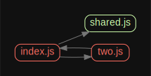

This repo shows a possible issue with Webpack and a circular import structure, in which:

- An entrypoint (src/index.js):
   - re-exports an import (as named export called "shared")
   - imports from two.js
- A dependency of the entrypoint (two.js):
   - imports the re-export from src/index.js noted above

## Setup

Run:
 * `npm install`
 * `npm run start`

...to see an example of Rollup (working), native browser ES module support (working in Chrome), and the Webpack case (currently breaks)

Run:
 * `npm run test:node`

under Node 12+ to see example output from Node which matches the Rollup and native browser cases above
